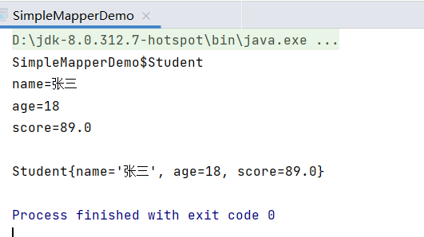

# simple-mapper
利用反射实现的一个简单的通用序列化/反序列化类 SimpleMapper

## 方法

+ `toString(Object obj)`:将对象obj转换为字符串
+ `fromString(String str)`:将字符串转换为对象

> 该类支支持最简单的类，即有默认构造方法，成员类型只有基本类型、包装类或String。
> 
> 序列化的格式为：第一行为类的名称，后面每行表示一个字段，用字符‘=’分隔，表示字段名称和字符串形式的值

## 运行截图

